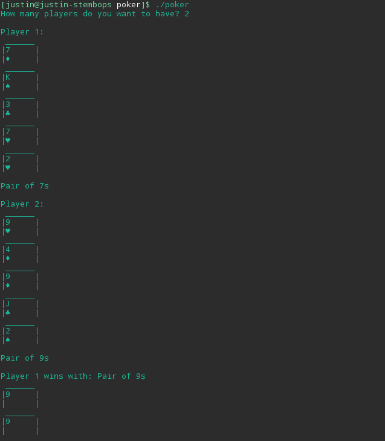

## Poker Hand Simulator

In order to run this simulator, run `gcc poker.c -o poker` and then `./poker`.  The program will then prompt the user to enter the number of desired players. After doing so, that number of hands will be printed using Ascii, and the winning hand will be revealed.

An example of the program in action:  